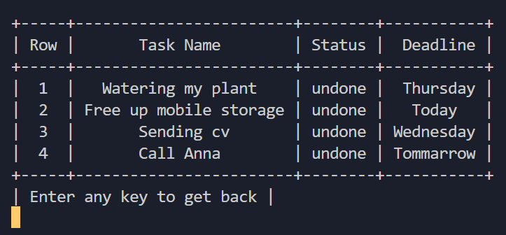

# Catcoach - Your CMD Todolist📑
### A super simple todo list via windows command line
#### (Project In Progress)

## Developer Todo 📝
- [x] [Fixing adding system]()
- [x] [Conflict in exit]()
- [ ] [Fixing row number in del.row]()
- [x] [Adding status checking]()
- [x] [Importing AsciiArts]()
- [x] [Main Page sudden crash]()
- [ ] [Working on gui]()

## Feature ⚙

* PrettyTable
* Automatic cls

## Countribute 🤝
Feel free to contribute

## Communication 💌
* [Website](https://www.pariya-tavangar.ir)
* [Github](https://github.com/Ptavangar)
